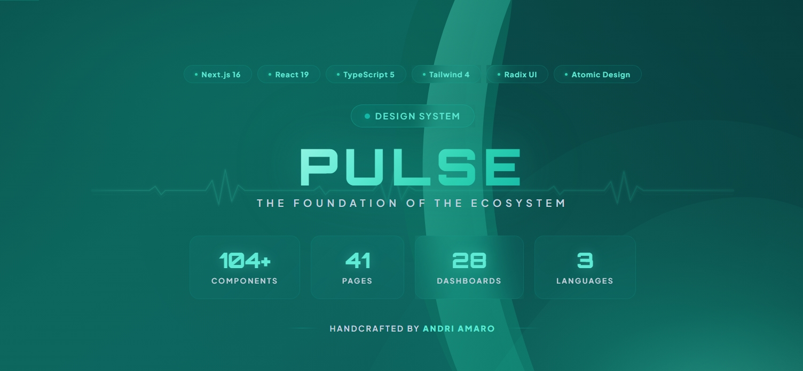
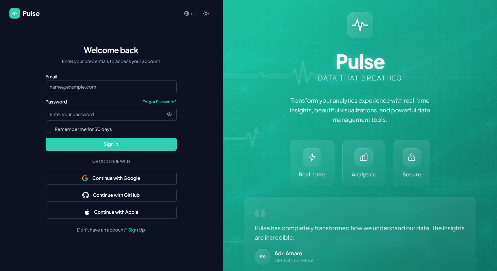
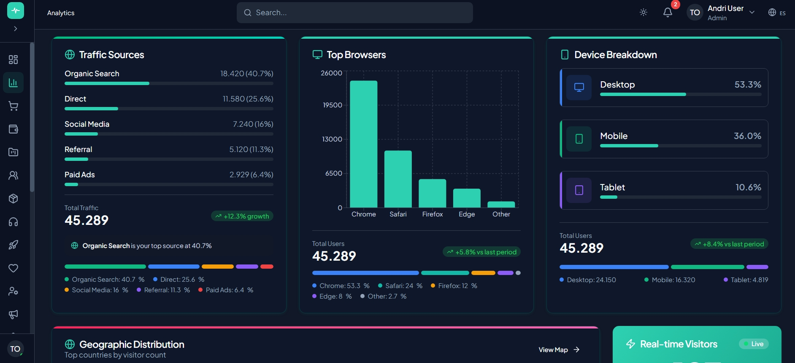
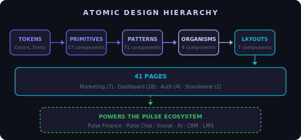

<div align="center">
  
</div>

<div align="center">

# Pulse

**The foundation powering the Pulse Ecosystem**


[](https://pulse-saas-theme.vercel.app)

</div>

<div align="center">
  <sub>Part of the <strong>Pulse Ecosystem</strong> · Powers
  <a href="https://github.com/AndriyAmaro/finance-flow">Pulse Finance</a> ·
  <a href="https://github.com/AndriyAmaro/realtime-chat">Pulse Chat</a> ·
  and more coming soon</sub>
</div>

---

## Overview

Pulse is a production-grade design system and SaaS platform with **100+ handcrafted components**, **56 pages**, and **full i18n support** in 3 languages. Built entirely from scratch using Atomic Design methodology · not forked from any template.

Every component, every page, and every animation was designed and coded by hand to serve as the unified foundation for an entire ecosystem of SaaS applications.

---

## Screenshots

<table>
  <tr>
    <td width="50%">
      <strong>Landing Page</strong><br/>
      
    </td>
    <td width="50%">
      <strong>Authentication</strong><br/>
      
    </td>
  </tr>
  <tr>
    <td width="50%">
      <strong>Dashboard Overview</strong><br/>
      
    </td>
    <td width="50%">
      <strong>Analytics Dashboard</strong><br/>
      
    </td>
  </tr>
</table>

---

## Why I Built This

I wanted to prove that one design system could power **multiple production apps** ·not just a portfolio piece, but a real foundation that scales. Every component is built to be reused across Finance dashboards, Chat interfaces, CRM pipelines, and beyond.

The result: **3 apps already powered by Pulse**, with more in development.

---

## Key Metrics

<div align="center">

| Metric | Value |
|:------:|:-----:|
| Handcrafted Components | **100+** |
| Total Pages | **56** |
| Dashboard Variants | **25** |
| Languages (i18n) | **3** |
| Radix UI Primitives | **12** |
| Route Groups | **4** |
| Architecture Decision Records | **9** |
| Documentation Pages | **3** |

</div>

---

## Architecture

The component library follows **Atomic Design** with a strict dependency hierarchy:

<div align="center">
  
</div>

<br />

| Tier | Count | Description | Examples |
|------|:-----:|-------------|----------|
| **Primitives** | 16 | Smallest UI units | Button, Input, Badge, Avatar, Switch |
| **Patterns** | 70 | Composed components | PricingTable, ChatUI, HeroSection, AuthCard |
| **Organisms** | 8 | Complex stateful components | DataTable, CommandPalette, Modal, Form |
| **Layouts** | 6 | Page-level structure | Sidebar, Header, Footer, DashboardGrid |

---

## 25 Dashboard Variants

Every industry vertical, one design system:

<div align="center">

`Analytics` `CRM` `E-commerce` `Finance` `Healthcare` `HR` `Marketing` `Real Estate` `Education` `Crypto` `Restaurant` `Calendar` `Chat` `Email` `Components` `Profile` `Notifications` `Reports` `Users` `Settings` `SaaS` `Projects` `Inventory` `HelpDesk` `Overview`

</div>

---

## Tech Stack

| Layer | Technology | Purpose |
|-------|-----------|---------|
| Framework | **Next.js 16** (App Router) | SSR, SSG, routing, middleware |
| UI | **React 19** | Component architecture |
| Styling | **Tailwind CSS 4** + CVA | Utility-first CSS + type-safe variants |
| Language | **TypeScript 5** | Type safety across the codebase |
| Icons | **Lucide React** | Consistent icon system |
| i18n | **next-intl** | Pathname-based internationalization |
| Theme | **next-themes** | Dark/light mode with system detection |
| Charts | **Recharts 3** | SVG-based data visualization |
| Forms | **React Hook Form** + **Zod** | Form management + schema validation |
| DnD | **@dnd-kit** | Drag and drop (Kanban, sortable lists) |
| Accessibility | **Radix UI** (12 primitives) | WAI-ARIA compliant headless components |
| Animations | **CSS Keyframes** + SVG | Custom ECG pulse animations (zero JS runtime) |

---

## Pages & Route Groups

| Group | Pages | Layout | Purpose |
|-------|:-----:|--------|---------|
| `(marketing)` | 20 | Full-width header + footer | Landing, about, blog, pricing, careers, community, docs, templates, and more |
| `(dashboard)` | 30 | Sidebar + header | Analytics, CRM, ecommerce, finance, and more |
| `(auth)` | 4 | Split-screen + branded animations | Login, register, forgot/reset password |
| `(standalone)` | 2 | Minimal full-width | Coming soon, maintenance |

---

## Key Features

- **100+ Components** ·Built from scratch, not forked from any template
- **Dark/Light Mode** ·System-aware theme with smooth transitions
- **3 Languages** ·Portuguese, English, and Spanish with pathname-based routing
- **25 Dashboard Variants** ·Analytics, CRM, ecommerce, finance, healthcare, HR, and more
- **Custom SVG Animations** ·ECG heartbeat pulses using CSS keyframes (zero JS runtime cost)
- **Accessible** ·Radix UI primitives for keyboard navigation and screen readers
- **Responsive** ·Mobile-first design across all components and pages
- **Performance** ·Server Components by default, automatic code splitting, CSS purging

---

## What Powers the Ecosystem

Pulse isn't just a standalone project ·it's the foundation for multiple SaaS apps:

<div align="center">

| App | Description | Stack | Status |
|:---:|-------------|-------|:------:|
| **[Pulse Finance](https://github.com/AndriyAmaro/finance-flow)** | Multi-tenant financial SaaS | Next.js + Hono + Prisma + Redis | Live |
| **[Pulse Chat](https://github.com/AndriyAmaro/realtime-chat)** | Real-time messaging platform | React + Express + Socket.io | Live |
| **Pulse Vexiat** | SaaS project management | Next.js + Prisma | In Dev |
| **Pulse AI** | AI dashboard & agent platform | Next.js + Vercel AI SDK | Planned |
| **Pulse CRM** | Customer relationship management | Next.js + Prisma + Redis | Planned |
| **Pulse LMS** | Learning management system | Next.js + Prisma + S3 | Planned |

</div>

---

## Project Structure

```
pulse-theme/
├── app/
│   └── [locale]/              # i18n routing (pt, en, es)
│       ├── (auth)/            # Split-screen auth layout
│       ├── (dashboard)/       # Sidebar + header layout
│       ├── (marketing)/       # Marketing header + footer (20 pages)
│       └── (standalone)/      # Minimal full-width layout
├── core/
│   ├── primitives/            # 16 atomic components
│   ├── patterns/              # 70 composed components
│   ├── organisms/             # 8 complex components
│   └── layouts/               # 6 layout components
├── locales/                   # i18n translation files (pt, en, es)
├── docs/                      # Architecture & decision records
├── assets/                    # SVG diagrams and screenshots
└── public/                    # Static assets
```

---

## Getting Started

```bash
# Install dependencies
npm install

# Start development server
npm run dev

# Build for production
npm run build
```

Open [http://localhost:3000](http://localhost:3000) to see the application.

---

## Documentation

| Document | Description |
|----------|-------------|
| [Architecture](docs/architecture.md) | System architecture, component hierarchy, data flow |
| [Decisions](docs/decisions.md) | Architecture Decision Records (ADRs) with trade-offs |
| [Scaling](docs/scaling.md) | 4-phase scaling strategy (0 to 100K+ users) |

---

## License

This project is licensed under a **Source Available License** ·you can view, study, and learn from the code. Commercial use requires a separate license. See [LICENSE](LICENSE) for details.

---

<div align="center">

**Built by [Andri Amaro](https://github.com/AndriyAmaro)**

<sub>One design system. Infinite SaaS.</sub>

<br />


</div>
