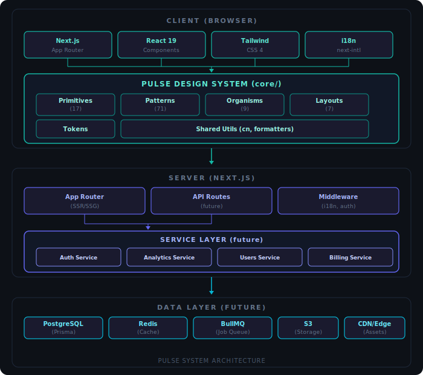

# System Architecture

> Pulse Design System & Application Platform

## Overview

Pulse is a production-grade design system and application platform built with Next.js 16, React 19, and Tailwind CSS 4. It follows Atomic Design principles with a clear separation of concerns across primitives, patterns, organisms, and layouts.

The architecture is designed to be framework-agnostic at the design token level, portable across projects, and scalable from a single-page app to a multi-tenant SaaS platform.

---

## High-Level Architecture

<div align="center">
  
</div>

---

## Design System Architecture (Atomic Design)

The component library follows a strict hierarchy based on Atomic Design methodology:

```
core/
├── tokens/           # Design tokens (colors, spacing, typography)
├── primitives/       # Atoms ·smallest UI units (Button, Input, Badge)
│   ├── Avatar/
│   ├── Badge/
│   ├── Button/
│   ├── Checkbox/
│   ├── Input/
│   ├── Select/
│   ├── Skeleton/
│   ├── Spinner/
│   ├── Switch/
│   ├── Tag/
│   ├── Textarea/
│   ├── ThemeToggle/
│   ├── Tooltip/
│   └── ...
├── patterns/         # Molecules + Templates ·composed components (71)
│   ├── Accordion/
│   ├── AuthBackground/
│   ├── BlogCard/
│   ├── ChatUI/
│   ├── CodeBlock/
│   ├── CookieConsent/
│   ├── DataTable/ → (organism)
│   ├── FAQAccordion/
│   ├── FeatureGrid/
│   ├── FileUpload/
│   ├── HeroSection/
│   ├── PricingTable/
│   ├── TestimonialCard/
│   └── ... (71 total)
├── organisms/        # Complex composed components
│   ├── Card/
│   ├── ChartWrapper/
│   ├── CommandPalette/
│   ├── DataTable/
│   ├── DropdownMenu/
│   ├── Form/
│   ├── Modal/
│   └── ...
└── layouts/          # Page-level layout components
    ├── DashboardGrid/
    ├── Footer/
    ├── Header/
    ├── MainContent/
    ├── PageHeader/
    └── Sidebar/
```

### Component Dependency Flow

```
Tokens → Primitives → Patterns → Organisms → Layouts → Pages
  ↑                                                        │
  └────────────────── Shared Utils ─────────────────────────┘
```

**Rules:**
- Primitives never import from patterns or organisms
- Patterns compose primitives and other patterns
- Organisms compose patterns and manage local state
- Layouts compose organisms and handle page structure
- Pages wire everything together with data and routing

---

## Application Structure

```
app/
├── [locale]/                    # i18n routing (pt, en, es)
│   ├── (auth)/                  # Auth route group
│   │   ├── layout.tsx           # Split-screen auth layout
│   │   ├── login/
│   │   ├── register/
│   │   └── reset-password/
│   ├── (dashboard)/             # Authenticated area
│   │   ├── layout.tsx           # Sidebar + header layout
│   │   ├── analytics/
│   │   ├── customers/
│   │   ├── settings/
│   │   └── ...
│   ├── (marketing)/             # Public marketing pages (20 pages)
│   │   ├── page.tsx             # Landing page
│   │   ├── about/
│   │   ├── blog/
│   │   ├── careers/
│   │   ├── changelog/
│   │   ├── community/
│   │   ├── contact/
│   │   ├── cookies/
│   │   ├── docs/
│   │   ├── gdpr/
│   │   ├── help/
│   │   ├── integrations/
│   │   ├── press/
│   │   ├── privacy/
│   │   ├── roadmap/
│   │   ├── security/
│   │   ├── templates/
│   │   ├── terms/
│   │   └── webinars/
│   └── (standalone)/            # Full-width pages
│       ├── coming-soon/
│       └── maintenance/
├── globals.css                  # Global styles + animations
└── middleware.ts                # i18n + auth middleware
```

### Route Groups Strategy

| Group | Purpose | Layout | Auth |
|-------|---------|--------|------|
| `(auth)` | Login, register, reset | Split-screen (form + branding) | Public |
| `(dashboard)` | App functionality | Sidebar + header | Protected |
| `(marketing)` | Landing, about, blog, careers, community, docs, templates, and more (20 pages) | Marketing header + footer | Public |
| `(standalone)` | Demo/showcase pages | Minimal, full-width | Public |

---

## Internationalization Architecture

```
messages/
├── pt.json          # Portuguese (primary)
├── en.json          # English
└── es.json          # Spanish

i18n/
├── routing.ts       # Locale routing config
├── navigation.ts    # Type-safe navigation helpers
└── request.ts       # Server-side i18n setup
```

- **Library:** `next-intl` with App Router integration
- **Strategy:** Pathname-based (`/pt/dashboard`, `/en/dashboard`)
- **Default locale:** `en` (with prefix)
- **Type-safe:** All translation keys are typed via `messages/` structure

---

## Styling Architecture

```
Design Tokens (CSS Custom Properties)
        │
        ▼
Tailwind CSS 4 (utility-first)
        │
        ▼
class-variance-authority (CVA) ·variant management
        │
        ▼
cn() utility (clsx + twMerge) ·conditional classes
```

### Theme System

- **Light/Dark mode:** `next-themes` with system preference detection
- **Color scale:** Semantic tokens mapped to Tailwind (`primary`, `accent`, `success`, etc.)
- **Custom animations:** Defined in `globals.css` (ECG pulses, gradients, reveals)
- **Motion:** Respects `prefers-reduced-motion` across all animations

---

## Data Flow (Current + Future)

### Current (Static/SSG)

```
Build Time → Static Generation → CDN → Client
                  │
                  ▼
          Translation files (JSON)
          Static page content
```

### Future (Full-Stack)

```
Client Request
    │
    ▼
Edge Middleware (auth check, i18n redirect)
    │
    ▼
Next.js Server (App Router)
    │
    ├─► Server Component → Direct DB query (Prisma)
    │                           │
    │                           ▼
    │                      PostgreSQL
    │
    ├─► API Route → Service Layer
    │                    │
    │                    ├─► Redis (cache check)
    │                    │     │ miss
    │                    │     ▼
    │                    ├─► PostgreSQL (query)
    │                    │     │
    │                    │     ▼
    │                    └─► Redis (cache set)
    │
    └─► Server Action → Direct mutation
                            │
                            ├─► PostgreSQL (write)
                            ├─► Redis (invalidate)
                            └─► BullMQ (async job)
```

---

## Key Technologies

| Layer | Technology | Purpose |
|-------|-----------|---------|
| Framework | **Next.js 16** (App Router) | SSR, SSG, routing, middleware |
| UI | **React 19** | Component architecture |
| Styling | Tailwind CSS 4 | Utility-first CSS |
| Variants | class-variance-authority | Component variant management |
| Icons | Lucide React | Consistent icon system |
| i18n | next-intl | Internationalization |
| Theme | next-themes | Dark/light mode |
| Charts | Recharts | Data visualization |
| Forms | React Hook Form + Zod | Form management + validation |
| DnD | @dnd-kit | Drag and drop (Kanban, etc.) |
| Animations | CSS Keyframes + SVG | Custom ECG pulse animations |
| Accessibility | Radix UI | Headless accessible primitives |

---

## Performance Considerations

- **Code Splitting:** Automatic via Next.js App Router (per-route)
- **Image Optimization:** Next.js `<Image>` with automatic WebP/AVIF
- **Font Loading:** `next/font` with font-display swap
- **CSS:** Tailwind CSS purges unused styles at build time
- **Bundle Size:** Tree-shakeable component exports via barrel files
- **Hydration:** Server Components by default, `'use client'` only when needed
- **Animation:** SVG-based animations (no JS animation libraries)
