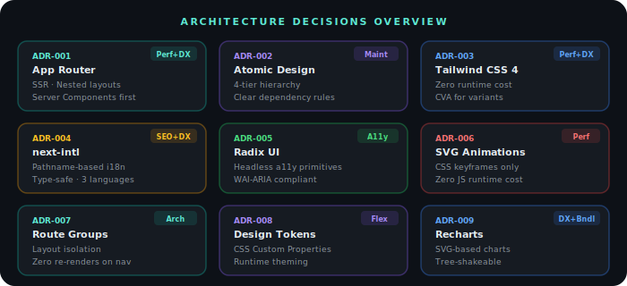

# Technical Decisions & Trade-offs

> A record of architectural decisions made during Pulse development, the reasoning behind each, and the trade-offs considered.

<div align="center">
  
</div>

---

## ADR-001: Next.js App Router over Pages Router

**Date:** 2025
**Status:** Accepted

### Context

Next.js offers two routing paradigms: the legacy Pages Router and the newer App Router (stable since Next.js 13.4). The App Router introduces Server Components, nested layouts, and streaming.

### Decision

Use App Router exclusively.

### Reasoning

- **Server Components by default** reduce client-side JavaScript and improve Time to Interactive
- **Nested layouts** enable shared UI (sidebar, header) without re-rendering on navigation
- **Route groups** `(auth)`, `(dashboard)`, `(marketing)` allow clean separation of concerns with independent layouts
- **Streaming** enables progressive rendering for data-heavy dashboard pages
- **Future-proof:** App Router is the recommended approach going forward

### Trade-offs

- Steeper learning curve for the `'use client'` boundary
- Some third-party libraries required updates for Server Component compatibility
- Slightly more complex mental model for data fetching patterns

---

## ADR-002: Atomic Design for Component Architecture

**Date:** 2025/2026
**Status:** Accepted

### Context

With 100 components, a clear organizational strategy is essential to prevent the codebase from becoming unmaintainable.

### Decision

Adopt Atomic Design methodology with four tiers: `primitives` (atoms), `patterns` (molecules/templates), `organisms`, and `layouts`.

### Reasoning

- **Clear dependency rules:** Primitives never import patterns; patterns never import organisms
- **Discoverability:** New developers can find components by their complexity level
- **Reusability:** Primitives are maximally reusable; patterns compose them into domain-specific components
- **Testing:** Each tier can be tested at appropriate granularity

### Trade-offs

- Some components blur the line between tiers (e.g., DataTable is both a pattern and organism)
- Barrel files (`index.ts`) at each level add maintenance overhead
- Developers must decide the correct tier for each new component

### Component Count (current)

| Tier | Count | Examples |
|------|-------|----------|
| Primitives | 16 | Button, Input, Badge, Avatar, Switch |
| Patterns | 70 | PricingTable, AuthCard, ChatUI, HeroSection |
| Organisms | 8 | DataTable, CommandPalette, Modal, Form |
| Layouts | 6 | Sidebar, Header, Footer, DashboardGrid |

---

## ADR-003: Tailwind CSS 4 over CSS-in-JS

**Date:** 2025
**Status:** Accepted

### Context

Styling approaches considered: CSS Modules, Styled Components, Emotion, Tailwind CSS.

### Decision

Tailwind CSS 4 with `class-variance-authority` (CVA) for variant management.

### Reasoning

- **Zero runtime cost:** No CSS-in-JS runtime in production
- **Server Component compatible:** No client-side style injection needed
- **CVA pattern:** Type-safe variants without Styled Components complexity
- **Design token alignment:** CSS custom properties bridge Tailwind and design tokens
- **Performance:** Unused styles are purged at build time (minimal CSS bundle)
- **DX:** Immediate visual feedback, no context switching between files

### Trade-offs

- Long class strings can reduce readability (mitigated by `cn()` utility and CVA)
- Dynamic styles require inline `style` or CSS variables
- Less isolation than CSS Modules (mitigated by component structure)

### Pattern: CVA + cn()

```tsx
// Component variant definition
const buttonVariants = cva('inline-flex items-center rounded-lg font-medium', {
  variants: {
    variant: {
      primary: 'bg-primary-500 text-white hover:bg-primary-600',
      outline: 'border border-slate-300 hover:bg-slate-50',
    },
    size: {
      sm: 'h-8 px-3 text-sm',
      md: 'h-10 px-4 text-base',
      lg: 'h-12 px-6 text-lg',
    },
  },
  defaultVariants: { variant: 'primary', size: 'md' },
})

// Usage with conditional classes
<Button className={cn(buttonVariants({ variant, size }), className)} />
```

---

## ADR-004: next-intl for Internationalization

**Date:** 2025
**Status:** Accepted

### Context

The application needs to support multiple languages (Portuguese, English, Spanish) with pathname-based routing.

### Decision

Use `next-intl` with App Router integration and pathname-based locale routing.

### Reasoning

- **App Router native:** First-class support for Server Components and App Router
- **Type-safe:** Compile-time validation of translation keys
- **Pathname-based:** `/pt/dashboard`, `/en/dashboard` - better for SEO than cookie-based
- **Message extraction:** JSON-based messages are easy to hand off to translators
- **Lightweight:** No heavy runtime compared to i18next

### Alternatives Considered

| Library | Rejected Because |
|---------|-----------------|
| `react-i18next` | Heavier runtime, designed for Pages Router |
| `next-translate` | Less active maintenance, fewer App Router features |
| Custom solution | Unnecessary complexity for a solved problem |

### Trade-offs

- All translation keys must be defined upfront (no dynamic key generation)
- JSON message files grow large for complex apps (mitigated by namespace splitting)
- Middleware required for locale detection and redirects

---

## ADR-005: Radix UI for Accessible Primitives

**Date:** 2025
**Status:** Accepted

### Context

Building accessible UI components from scratch is error-prone and time-consuming. WAI-ARIA compliance requires handling keyboard navigation, focus management, screen reader announcements, and more.

### Decision

Use Radix UI headless primitives as the foundation for interactive components (Dialog, Dropdown, Select, Accordion, etc.).

### Reasoning

- **Headless:** Full control over styling with zero visual opinions
- **Accessible:** WAI-ARIA compliant out of the box
- **Composable:** Compound component API aligns with our Atomic Design approach
- **Production-tested:** Used by Vercel, Linear, and other major products
- **Unstyled:** No style conflicts with Tailwind CSS

### Trade-offs

- Bundle includes Radix runtime for each primitive used
- Component API is opinionated (compound components pattern)
- Some edge cases require workarounds (e.g., portal rendering with SSR)

---

## ADR-006: SVG-Based Animations over JS Libraries

**Date:** 2025
**Status:** Accepted

### Context

The Pulse brand identity relies on ECG heartbeat animations throughout the UI (hero, auth pages, backgrounds). These animations need to be performant, accessible, and lightweight.

### Decision

Use pure CSS keyframes + SVG `stroke-dasharray` / `stroke-dashoffset` for all brand animations. No JavaScript animation libraries.

### Reasoning

- **Performance:** CSS/SVG animations run on the compositor thread, not the main thread
- **Bundle size:** Zero additional JavaScript for animations
- **Accessibility:** Native `prefers-reduced-motion` support via CSS media queries
- **SSR-safe:** No hydration mismatches since animations are CSS-only
- **GPU-accelerated:** Transform and opacity animations leverage hardware acceleration

### Alternatives Considered

| Library | Bundle Size | Rejected Because |
|---------|------------|-----------------|
| Framer Motion | ~32KB | Too heavy for decorative animations |
| GSAP | ~28KB | Overkill for SVG path animations |
| Lottie | ~50KB+ | Requires After Effects workflow |
| React Spring | ~18KB | Unnecessary runtime for CSS-achievable effects |

### Animation Technique

```css
/* ECG draw-on effect using stroke-dashoffset */
@keyframes ecg-draw {
  0%   { stroke-dashoffset: 1400; opacity: 0; }
  3%   { opacity: 0.2; }
  32%  { stroke-dashoffset: 0; opacity: 0.16; }
  68%  { stroke-dashoffset: 0; opacity: 0.14; }
  100% { stroke-dashoffset: 0; opacity: 0; }
}
```

### Trade-offs

- More verbose SVG path definitions
- Complex timing requires manual keyframe tuning
- Less declarative than Framer Motion's `animate` prop
- No spring physics (but not needed for ECG-style animations)

---

## ADR-007: Route Groups for Layout Isolation

**Date:** 2025
**Status:** Accepted

### Context

The application has four distinct layout contexts: marketing pages (header + footer), dashboard (sidebar + header), auth (split-screen), and standalone showcase pages.

### Decision

Use Next.js route groups `(marketing)`, `(dashboard)`, `(auth)`, and `(standalone)` to isolate layouts.

### Reasoning

- **Zero layout re-renders:** Navigating within a group preserves the layout
- **Clean URL structure:** Route groups don't affect the URL path
- **Independent concerns:** Auth layout doesn't need sidebar logic
- **Middleware integration:** Different auth rules per group

### Structure

```
app/[locale]/
├── (auth)/layout.tsx        → Split-screen with branded right panel
├── (dashboard)/layout.tsx   → Sidebar + header + main content
├── (marketing)/layout.tsx   → Marketing header + footer
└── (standalone)/layout.tsx  → Minimal, full-bleed layout
```

---

## ADR-008: Design Tokens Strategy

**Date:** 2025
**Status:** Accepted

### Context

A design system needs a single source of truth for colors, spacing, typography, and other visual properties that can be consumed by both CSS and JavaScript.

### Decision

CSS Custom Properties as the primary token layer, mapped to Tailwind CSS utilities.

### Reasoning

- **Runtime theming:** CSS variables enable dark/light mode without rebuilding
- **Framework-agnostic:** Tokens work in any CSS context, not just React
- **Performance:** No JavaScript needed for theme switching
- **Tailwind integration:** Custom properties map directly to Tailwind's config

### Token Categories

| Category | Example | Usage |
|----------|---------|-------|
| Color | `--primary-500` | Brand, semantic, neutral colors |
| Spacing | Tailwind scale | Consistent spacing via utilities |
| Typography | `--font-sans` | Font families, sizes, weights |
| Radius | `--radius-lg` | Border radius consistency |
| Shadow | `--shadow-xl` | Elevation system |
| Animation | `--duration-normal` | Timing consistency |

---

## ADR-009: Recharts for Data Visualization

**Date:** 2025
**Status:** Accepted

### Context

The dashboard requires various chart types: line, area, bar, pie, and composed charts with responsive behavior and theme support.

### Decision

Use Recharts as the charting library, wrapped in a custom `ChartWrapper` organism.

### Reasoning

- **React-native:** Built on React components, not DOM manipulation
- **SVG-based:** Crisp rendering at any resolution, easy to style
- **Responsive:** `ResponsiveContainer` handles resize automatically
- **Customizable:** Every element can be styled via props
- **Lightweight:** Only import chart types you use (tree-shakeable)

### Alternatives Considered

| Library | Rejected Because |
|---------|-----------------|
| D3.js | Too low-level, requires imperative DOM manipulation |
| Chart.js | Canvas-based (not SVG), harder to theme |
| Nivo | Heavier bundle, more opinionated styling |
| Victory | Similar to Recharts but smaller community |

### Trade-offs

- Limited animation capabilities compared to D3
- Some advanced chart types require custom implementations
- TypeScript types could be more comprehensive

---

## Decision Matrix Summary

| Decision | Priority | Complexity | Reversibility |
|----------|----------|------------|---------------|
| App Router | Performance, DX | Medium | Low (major refactor) |
| Atomic Design | Maintainability | Low | Medium |
| Tailwind CSS | Performance, DX | Low | Medium |
| next-intl | SEO, DX | Low | High |
| Radix UI | Accessibility | Low | Medium |
| SVG Animations | Performance | Medium | High |
| Route Groups | Architecture | Low | Medium |
| CSS Tokens | Flexibility | Low | High |
| Recharts | DX, Bundle | Low | High |
