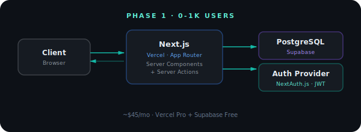
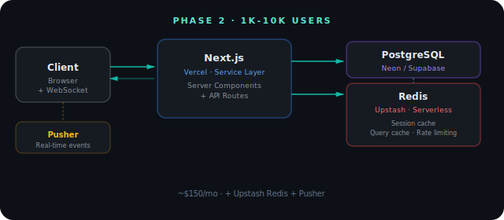
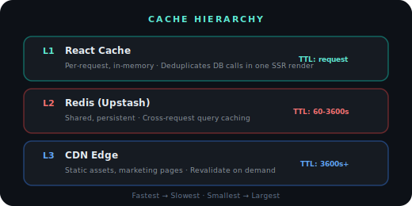
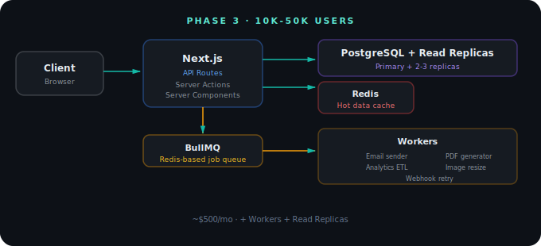
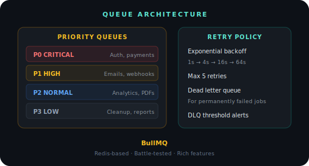
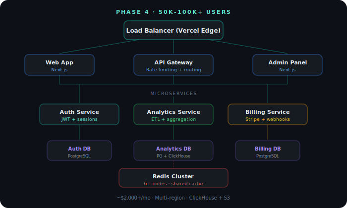
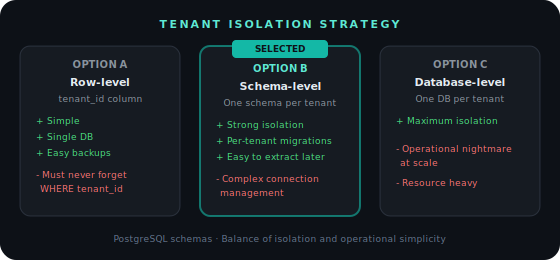
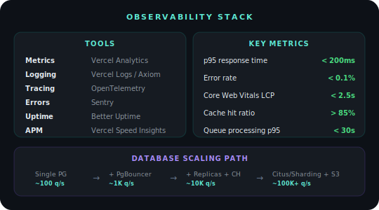

# Scaling Strategy

> How Pulse is architected to scale from a portfolio project to a production SaaS serving 100,000+ users.

---

## Current State

Pulse is currently a **statically generated** Next.js application deployed on Vercel. All pages are pre-rendered at build time with zero backend dependencies.

```
Current: Static Site (SSG)
├── Build time: ~30s
├── Pages: Pre-rendered HTML
├── Data: Static JSON (translations)
├── Hosting: Vercel Edge Network
├── Users: Unlimited (CDN-served)
└── Cost: ~$0 (Hobby tier)
```

This is intentional. The frontend architecture is complete and production-ready. The backend layers described below can be added incrementally without rewriting the frontend.

---

## Phase 1: Add Authentication & Database (0 → 1,000 users)

### Architecture

<div align="center">
  
</div>

### Changes Required

| Component | Current | Phase 1 |
|-----------|---------|---------|
| Auth | Static forms | NextAuth.js (JWT sessions) |
| Database | None | PostgreSQL via Prisma |
| Hosting | Vercel Hobby | Vercel Pro |
| Data fetching | Static | Server Components + Prisma |

### Database Schema (Prisma)

```prisma
model User {
  id            String    @id @default(cuid())
  email         String    @unique
  name          String?
  passwordHash  String
  role          Role      @default(USER)
  createdAt     DateTime  @default(now())
  updatedAt     DateTime  @updatedAt
  sessions      Session[]
  profile       Profile?
}

model Profile {
  id          String  @id @default(cuid())
  userId      String  @unique
  user        User    @relation(fields: [userId], references: [id])
  company     String?
  avatarUrl   String?
  timezone    String  @default("UTC")
  locale      String  @default("pt")
}

enum Role {
  USER
  ADMIN
  SUPER_ADMIN
}
```

### Why This Works at 1K Users

- PostgreSQL handles 1K concurrent connections easily
- Vercel serverless functions auto-scale per request
- No caching needed yet (queries are fast enough)
- JWT sessions avoid session storage overhead

---

## Phase 2: Add Caching & Real-time Features (1,000 → 10,000 users)

### Architecture

<div align="center">
  
</div>

### Redis Caching Strategy

<div align="center">
  
</div>

### Cache Implementation Pattern

```typescript
// Service layer with cache-aside pattern
async function getAnalytics(userId: string): Promise<Analytics> {
  const cacheKey = `analytics:${userId}`

  // L2: Check Redis
  const cached = await redis.get(cacheKey)
  if (cached) return JSON.parse(cached)

  // Cache miss: Query database
  const data = await prisma.analytics.findMany({
    where: { userId },
    orderBy: { date: 'desc' },
    take: 30,
  })

  // Cache for 5 minutes
  await redis.set(cacheKey, JSON.stringify(data), { ex: 300 })

  return data
}
```

### Cache Invalidation Strategy

| Event | Invalidation |
|-------|-------------|
| User updates profile | Delete `user:{id}` |
| New analytics data | Delete `analytics:{userId}` |
| Admin changes | Flush namespace `admin:*` |
| Deploy | Flush all (via Vercel webhook) |

### Why Redis (Upstash) Specifically

- **Serverless-native:** HTTP-based, no persistent connections needed
- **Global replication:** Data cached at the edge, near users
- **Pay-per-request:** No idle costs (perfect for growing apps)
- **Built-in rate limiting:** `@upstash/ratelimit` library

---

## Phase 3: Background Jobs & Advanced Features (10,000 → 50,000 users)

### Architecture

<div align="center">
  
</div>

### Queue Strategy (BullMQ)

<div align="center">
  
</div>

### Job Types

| Job | Priority | Timeout | Retries |
|-----|----------|---------|---------|
| Send email | HIGH | 30s | 3 |
| Generate PDF report | NORMAL | 60s | 2 |
| Process analytics | NORMAL | 120s | 3 |
| Resize uploaded image | NORMAL | 45s | 2 |
| Webhook delivery | HIGH | 15s | 5 |
| Database cleanup | LOW | 300s | 1 |
| Send notification | HIGH | 10s | 3 |

### Why BullMQ Over Alternatives

| Solution | Rejected Because |
|----------|-----------------|
| AWS SQS | Vendor lock-in, cold starts |
| RabbitMQ | Separate infrastructure to manage |
| Inngest | Good but less control over workers |
| Trigger.dev | Newer, smaller ecosystem |
| **BullMQ** | **Redis-based (reuse existing), battle-tested, rich features** |

---

## Phase 4: Multi-Tenant & Microservices (50,000 → 100,000+ users)

### Architecture

<div align="center">
  
</div>

### Multi-Tenancy Strategy

<div align="center">
  
</div>

### Microservices Boundary Rules

Only extract a service when ALL of these are true:

1. **Independent scaling** is needed (e.g., analytics processes 10x more data than auth)
2. **Different team** will own it (organizational boundary)
3. **Different data store** makes sense (e.g., ClickHouse for analytics)
4. **Independent deployment** adds value (e.g., billing can't go down with deploys)

### Service Communication

```
Synchronous (REST/gRPC):
  - Auth verification
  - User profile lookup
  - Billing status check

Asynchronous (Event-driven via Redis Streams):
  - user.created → Provision tenant schema
  - subscription.upgraded → Update feature flags
  - analytics.processed → Send weekly digest
  - user.deleted → GDPR cleanup across services
```

---

## Monitoring, Observability & Database Scaling

<div align="center">
  
</div>

---

## Cost Estimation by Phase

| Phase | Users | Monthly Cost | Stack |
|-------|-------|-------------|-------|
| Current | Unlimited (static) | $0 | Vercel Hobby |
| Phase 1 | 1,000 | ~$45 | Vercel Pro + Supabase Free |
| Phase 2 | 10,000 | ~$150 | + Upstash Redis + Pusher |
| Phase 3 | 50,000 | ~$500 | + Workers + Read Replicas |
| Phase 4 | 100,000+ | ~$2,000+ | + ClickHouse + S3 + Multi-region |

---

## Key Principles

1. **Scale vertically first.** A single PostgreSQL instance handles more than most people think.
2. **Add caching before adding servers.** Redis eliminates 80% of database load.
3. **Extract services only when forced.** A well-structured monolith outperforms a poorly designed microservices architecture.
4. **Measure before optimizing.** Add observability before adding infrastructure.
5. **Design for failure.** Every external call should have a timeout, retry, and fallback.
